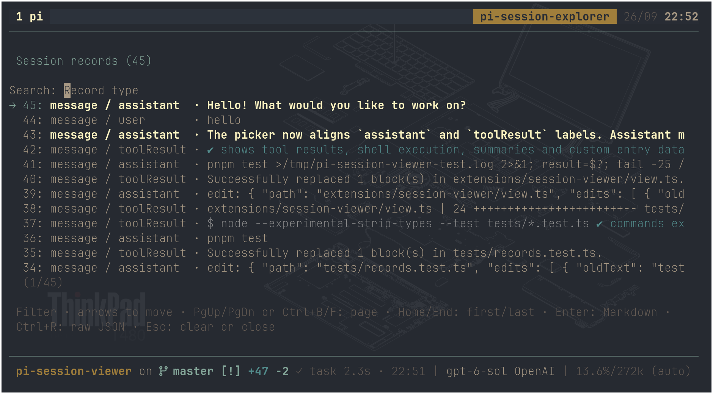
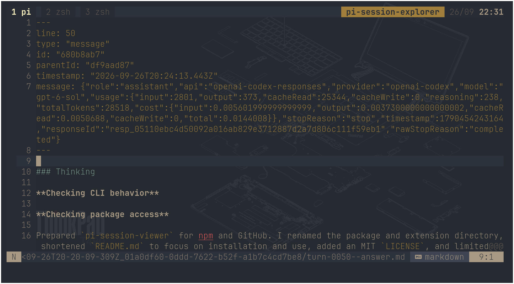

# Pi Session Viewer

Browse the records in your current Pi session and open any record in your editor. The viewer shows the session header, messages, tool results, and other JSONL records. It does not change the session or the active conversation.

| Picker | Editor |
| - | - |
|  |  |

## Install

Set `EDITOR` to an editor that waits until you close the file. For example:

```sh
export EDITOR=vim
pi install npm:pi-session-viewer
```

## Use

- `/turns` opens a list of records, newest first. Type to filter by record type; use the arrow keys to move. Press Enter to open the selected record as Markdown, or Ctrl+R to open its raw JSON. Press Escape to clear the filter or close the list. Close the editor to return to the list.
- `/last-turn` opens the latest assistant message in your editor.

The viewer needs an interactive terminal and a session saved as a JSONL file. Editor files stay in the `pi-session-explorer` directory under your system temporary directory, so changes to those files remain when you open them again. These changes do not affect the session. For a graphical editor, use a command that waits, such as `EDITOR='code --wait'`. Only use an editor command you trust, since it runs through the shell.
